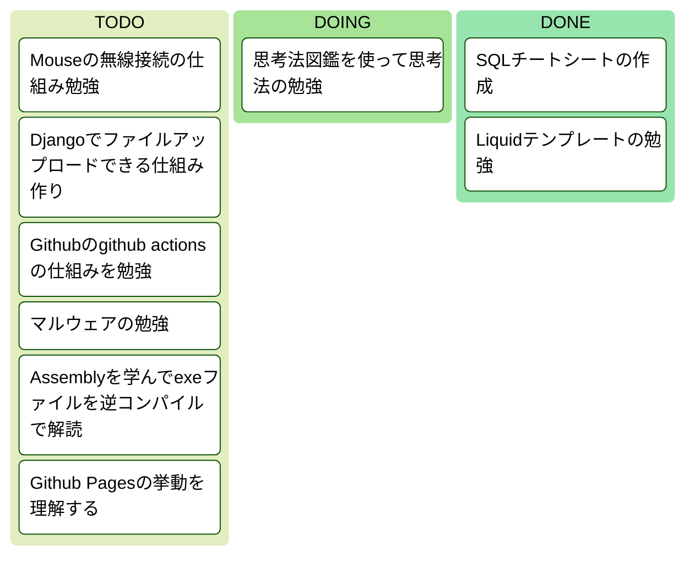

 
<!-- no robot! -->
<meta name="robots" content="noindex">

```mermaid
%%{init: {'theme':'forest'}}%%
kanban
  column1[TODO]
    task2[Mouseの無線接続の仕組み勉強]
    task3[Djangoでファイルアップロードできる仕組み作り]
    task5[Githubのgithub actionsの仕組みを勉強]
    task6[マルウェアの勉強]
    task7[Assemblyを学んでexeファイルを逆コンパイルで解読]
    taks8[Github Pagesの挙動を理解する]
  column2[DOING]
    task4[思考法図鑑を使って思考法の勉強]
  column3[DONE]
    task1[SQLチートシートの作成]
    task4[Liquidテンプレートの勉強]
```