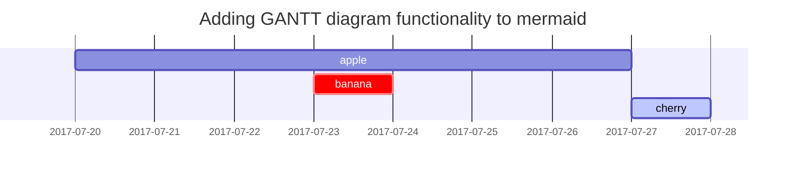

> Under Construction
{: .prompt-info }

ご提示いただいたソースの内容を、Markdown形式に変換して提供します。

このソースは、ChirpyというJekyllテーマにおけるテキストとタイポグラフィの例を示す記事の抜粋であり、標準的なMarkdown要素と、MermaidやMathJaxなど特定の拡張機能を必要とする要素が含まれています。

---

## Chirpy A text-focused Jekyll theme
### *Post* Text and Typography

Examples of text, typography, math equations, diagrams, flowcharts, pictures, videos, and more.

#### Posted Aug 8, 2019 Updated Jul 2, 2024 Responsive rendering of Chirpy theme on multiple devices. By Cotes Chung *3 min* read *Text and Typography* *Text and Typography*

Headings

### H1 — heading
#### H2 — heading
##### H3 — heading
###### H4 — heading

#### Paragraph
Quisque egestas convallis ipsum, ut sollicitudin risus tincidunt a. Maecenas interdum malesuada egestas. Duis consectetur porta risus, sit amet vulputate urna facilisis ac. Phasellus semper dui non purus ultrices sodales. Aliquam ante lorem, ornare a feugiat ac, finibus nec mauris. Vivamus ut tristique nisi. Sed vel leo vulputate, efficitur risus non, posuere mi. Nullam tincidunt bibendum rutrum. Proin commodo ornare sapien. Vivamus interdum diam sed sapien blandit, sit amet aliquam risus mattis. Nullam arcu turpis, mollis quis laoreet at, placerat id nibh. Suspendisse venenatis eros eros.

---

#### Lists

##### Ordered list
1. Firstly
2. Secondly
3. Thirdly

##### Unordered list
* Chapter
* Section
* Paragraph

##### ToDo list
* [ ] Job
* [ ] Step 1
* [ ] Step 2
* [ ] Step 3

##### Description list
Sun
: the star around which the earth orbits
Moon
: the natural satellite of the earth, visible by reflected light from the sun

---

#### Block Quote
> This line shows the *block quote*.

#### Prompts (拡張機能に依存)
> **tip**
> An example showing the tip type prompt.
>
> **info**
> An example showing the info type prompt.
>
> **warning**
> An example showing the warning type prompt.
>
> **danger**
> An example showing the danger type prompt.

---

#### Tables
| Company | Contact | Country |
| :--- | :--- | :--- |
| Alfreds Futterkiste | Maria Anders | Germany |
| Island Trading | Helen Bennett | UK |
| Magazzini Alimentari Riuniti | Giovanni Rovelli | Italy |

---

#### Links
<http://127.0.0.1:4000>

#### Footnote
Click the hook will locate the footnote[^1], and here is another footnote[^2].

#### Inline code
This is an example of `Inline Code`.

#### Filepath
Here is the `/path/to/the/file.extend`.

#### Code blocks

##### Common
```
This is a common code snippet, without syntax highlight and line number.
```

##### Specific Language
```bash
if [ $? -ne 0 ] ; then echo "The command was not successful." ; #do the needful / exit fi ;
```

##### Specific filename
```css
@import "colors/light-typography", "colors/dark-typography" ;
```

---

#### Mathematics (MathJaxを使用)
The mathematics powered by **MathJax**:

\[\begin{equation} \sum_{n=1}^\infty 1/n^2 = \frac{\pi^2}{6} \label{eq:series} \end{equation}\]
We can reference the equation as \eqref{eq:series}.
When $a \ne 0$, there are two solutions to $ax^2 + bx + c = 0$ and they are
\[x = {-b \pm \sqrt{b^2-4ac} \over 2a}\]

#### Mermaid SVG (Mermaid拡張機能を使用)


#### Images
##### Default (with caption)
*Full screen width and center alignment*
<!-- 画像の埋め込みタグをここに配置 -->

##### Left aligned
<!-- 画像の埋め込みタグをここに配置 -->

##### Float to left
Praesent maximus aliquam sapien. Sed vel neque in dolor pulvinar auctor. Maecenas pharetra, sem sit amet interdum posuere, tellus lacus eleifend magna, ac lobortis felis ipsum id sapien. Proin ornare rutrum metus, ac convallis diam volutpat sit amet. Phasellus volutpat, elit sit amet tincidunt mollis, felis mi scelerisque mauris, ut facilisis leo magna accumsan sapien. In rutrum vehicula nisl eget tempor. Nullam maximus ullamcorper libero non maximus. Integer ultricies velit id convallis varius. Praesent eu nisl eu urna finibus ultrices id nec ex. Mauris ac mattis quam. Fusce aliquam est nec sapien bibendum, vitae malesuada ligula condimentum.

##### Float to right
Praesent maximus aliquam sapien. Sed vel neque in dolor pulvinar auctor. Maecenas pharetra, sem sit amet interdum posuere, tellus lacus eleifend magna, ac lobortis felis ipsum id sapien. Proin ornare rutrum metus, ac convallis diam volutpat sit amet. Phasellus volutpat, elit sit amet tincidunt mollis, felis mi scelerisque mauris, ut facilisis leo magna accumsan sapien. In rutrum vehicula nisl eget tempor. Nullam maximus ullamcorper libero non maximus. Integer ultricies velit id convallis varius. Praesent eu nisl eu urna finibus ultrices id nec ex. Mauris ac mattis quam. Fusce aliquam est nec sapien bibendum, vitae malesuada ligula condimentum.

##### Dark/Light mode & Shadow
The image below will toggle dark/light mode based on theme preference, notice it has shadows.
<!-- 画像の埋め込みタグをここに配置 -->

#### Video
<!-- 動画の埋め込みタグをここに配置 -->

---

#### Reverse Footnote
[^1]: The footnote source ↩︎
[^2]: The 2nd footnote source ↩︎

#### Blogging, Demotypography
This post is licensed under CC BY 4.0 by the author.
Share

Recently Updated
* Writing a New Post
* Getting Started
* Text and Typography
* Customize the Favicon

#### Trending Tags
#### favicongetting startedtypographywriting

Contents
##### Further Reading
#### Trending Tags
favicongetting startedtypographywriting
A new version of content is available.
