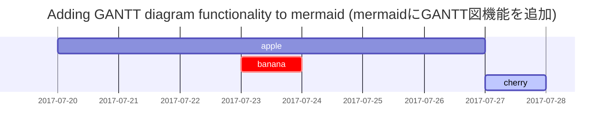

> Under Construction
{: .prompt-info }

---

## Chirpy テキストに特化したJekyllテーマ
### *投稿* テキストとタイポグラフィ

テキスト、タイポグラフィ、数式、図、フローチャート、画像、動画などの例です。

#### 投稿日 2019年8月8日 更新日 2024年7月2日 複数のデバイスでのChirpyテーマのレスポンシブなレンダリング。 Cotes Chung 著 *3分* 読了 *テキストとタイポグラフィ* *テキストとタイポグラフィ*

見出し

### H1 — heading (見出し)
#### H2 — heading (見出し)
##### H3 — heading (見出し)
###### H4 — heading (見出し)

#### 段落
Quisque egestas convallis ipsum, ut sollicitudin risus tincidunt a. Maecenas interdum malesuada egestas. Duis consectetur porta risus, sit amet vulputate urna facilisis ac. Phasellus semper dui non purus ultrices sodales. Aliquam ante lorem, ornare a feugiat ac, finibus nec mauris. Vivamus ut tristique nisi. Sed vel leo vulputate, efficitur risus non, posuere mi. Nullam tincidunt bibendum rutrum. Proin commodo ornare sapien. Vivamus interdum diam sed sapien blandit, sit amet aliquam risus mattis. Nullam arcu turpis, mollis quis laoreet at, placerat id nibh. Suspendisse venenatis eros eros.

---

#### リスト

##### 順序付きリスト
1. Firstly (最初に)
2. Secondly (次に)
3. Thirdly (三番目に)

##### 順序なしリスト
* Chapter (章)
* Section (セクション)
* Paragraph (段落)

##### ToDoリスト
* [ ] Job (仕事)
* [ ] Step 1 (ステップ 1)
* [ ] Step 2 (ステップ 2)
* [ ] Step 3 (ステップ 3)

##### 定義リスト
Sun (太陽)
: the star around which the earth orbits (地球が周回する星)
Moon (月)
: the natural satellite of the earth, visible by reflected light from the sun (太陽からの反射光で見える地球の天然の衛星)

---

#### 引用ブロック
> This line shows the *block quote*. (この行は*引用ブロック*を示しています。)

#### プロンプト (拡張機能に依存)
> **tip**
> An example showing the tip type prompt. (tip タイププロンプトの例)
>
> **info**
> An example showing the info type prompt. (info タイププロンプトの例)
>
> **warning**
> An example showing the warning type prompt. (warning タイププロンプトの例)
>
> **danger**
> An example showing the danger type prompt. (danger タイププロンプトの例)

---

#### テーブル
| Company (会社) | Contact (連絡先) | Country (国) |
| :--- | :--- | :--- |
| Alfreds Futterkiste | Maria Anders | Germany (ドイツ) |
| Island Trading | Helen Bennett | UK (イギリス) |
| Magazzini Alimentari Riuniti | Giovanni Rovelli | Italy (イタリア) |

---

#### リンク
<http://127.0.0.1:4000>

#### 注釈
Click the hook will locate the footnote[^1], and here is another footnote[^2]. (フックをクリックすると注釈[^1]に移動し、ここに別の注釈[^2]があります。)

#### インラインコード
This is an example of `Inline Code`. (これは `Inline Code` の例です。)

#### ファイルパス
Here is the `/path/to/the/file.extend`. (ここに `/path/to/the/file.extend` があります。)

#### コードブロック

##### 共通
```
This is a common code snippet, without syntax highlight and line number.
(これは、シンタックスハイライトも行番号もない、一般的なコードスニペットです。)
```

##### 特定の言語
```bash
if [ $? -ne 0 ] ; then echo "The command was not successful." ; #do the needful / exit fi ;
```

##### 特定のファイル名
```css
@import "colors/light-typography", "colors/dark-typography" ;
```

---

#### 数学 (MathJaxを使用)
**MathJax** によって提供される数学:

\[\begin{equation} \sum_{n=1}^\infty 1/n^2 = \frac{\pi^2}{6} \label{eq:series} \end{equation}\]
We can reference the equation as \eqref{eq:series}. (この方程式を \eqref{eq:series} として参照できます。)
When $a \ne 0$, there are two solutions to $ax^2 + bx + c = 0$ and they are ( $a \ne 0$ のとき、$ax^2 + bx + c = 0$ には2つの解があり、それらは次の通りです)
\[x = {-b \pm \sqrt{b^2-4ac} \over 2a}\]

#### Mermaid SVG (Mermaid拡張機能を使用)


#### 画像
##### デフォルト（キャプション付き）
*Full screen width and center alignment* (全画面幅と中央揃え)
<!-- 画像の埋め込みタグをここに配置 -->

##### 左揃え
<!-- 画像の埋め込みタグをここに配置 -->

##### 左にフロート
Praesent maximus aliquam sapien. [ラテン語の例示テキスト]... Fusce aliquam est nec sapien bibendum, vitae malesuada ligula condimentum.

##### 右にフロート
Praesent maximus aliquam sapien. [ラテン語の例示テキスト]... Fusce aliquam est nec sapien bibendum, vitae malesuada ligula condimentum.

##### ダーク/ライトモードと影
The image below will toggle dark/light mode based on theme preference, notice it has shadows. (以下の画像はテーマ設定に基づいてダーク/ライトモードを切り替えます。影があることに注意してください。)
<!-- 画像の埋め込みタグをここに配置 -->

#### 動画
<!-- 動画の埋め込みタグをここに配置 -->

---

#### 逆注釈
[^1]: The footnote source ↩︎ (注釈の参照元)
[^2]: The 2nd footnote source ↩︎ (2番目の注釈の参照元)

#### ブログ、デモタイポグラフィ
This post is licensed under CC BY 4.0 by the author. Share (この投稿は著者によりCC BY 4.0でライセンスされています。共有)

最近更新された記事
* Writing a New Post (新しい投稿を書くこと)
* Getting Started (始めること)
* Text and Typography (テキストとタイポグラフィ)
* Customize the Favicon (ファビコンをカスタマイズする)

#### トレンドタグ
#### favicongetting startedtypographywriting (ファビコン、始めること、タイポグラフィ、書くこと)

コンテンツ
##### さらに読む
#### トレンドタグ
favicongetting startedtypographywriting (ファビコン、始めること、タイポグラフィ、書くこと)
A new version of content is available. (新しいバージョンのコンテンツが利用可能です。)
