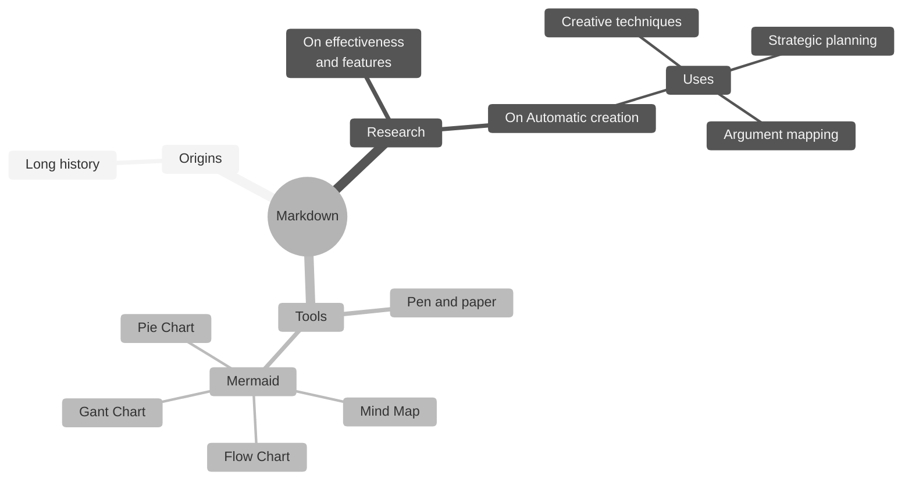

### 🧜‍♀️ Mermaidとは
JavaScriptベースの図表作成ツール  

> マインドマップ 

```mermaid
%%{init: {'theme':'neutral'}}%%
mindmap
  root((Markdown))
    Origins
      Long history
    Research
      On effectiveness<br/>and features
      On Automatic creation
        Uses
            Creative techniques
            Strategic planning
            Argument mapping
    Tools
      Pen and paper
      Mermaid
        Mind Map
        Flow Chart
        Gant Chart
        Pie Chart
```
{: .prompt-info }