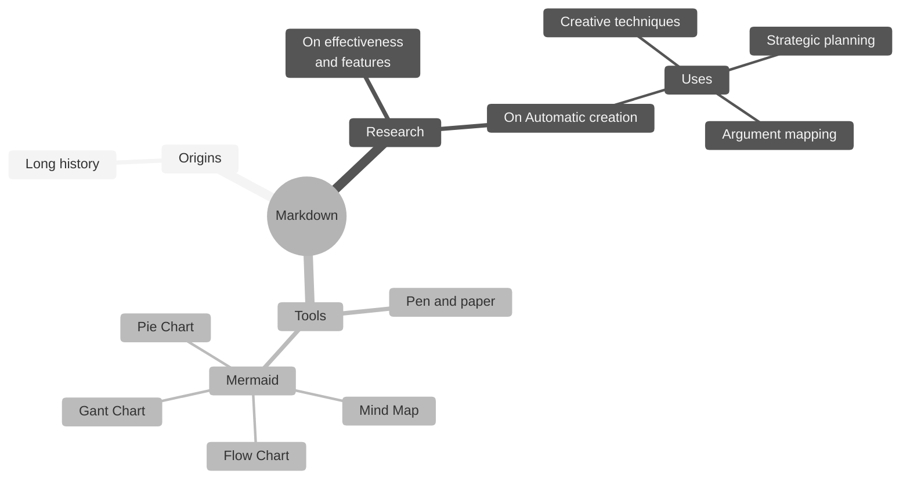

### 📝 Markdownとは
Markup言語の一つ。
> マークアップとは伝統的な出版のプロセスにおいて、著者、編集者、印刷者などの間で指示を伝えるための書き込みを行うという意味の「mark up」に由来する単語である。<br><br>マークアップ言語には伝統的な文書作成、組版のための言語であるSGML、TeXのようなもののほか、HTMLのようなハイパーテキストの作成、YAMLやXMLのようなより一般的なデータ構造の記述など、様々な言語が存在している。<br><br>
[引用:Wikipedia](https://ja.wikipedia.org/wiki/%E3%83%9E%E3%83%BC%E3%82%AF%E3%82%A2%E3%83%83%E3%83%97%E8%A8%80%E8%AA%9E)

<br>

### ✒️ Markdownの書き方
#### 段落
空行が段落として認識される。
``` markdown
1行目の文章。これで一段目。

空行を挟んで、これが二段目。
```


<br>

### 🧜‍♀️ Mermaidとは
JavaScriptベースの図表作成ツール<br><br>

> マインドマップ<br>

{: .prompt-info }

<br>

### 📚 参考
- [Mermaidドキュメント](https://docs.min87.com/ja/mermaid/intro/)