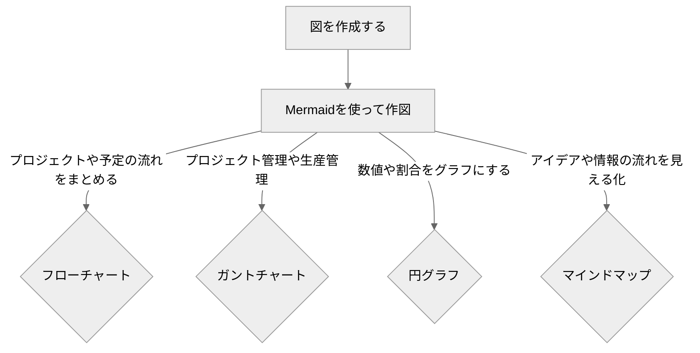
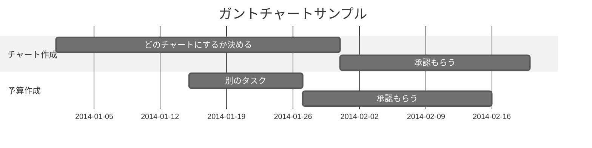
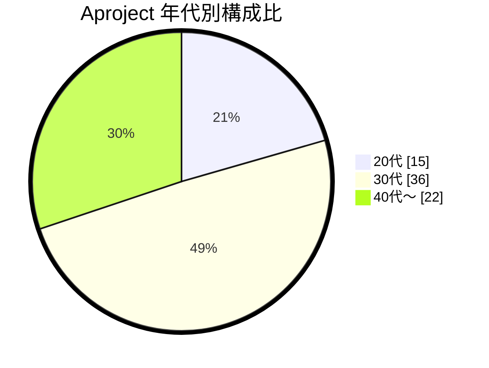
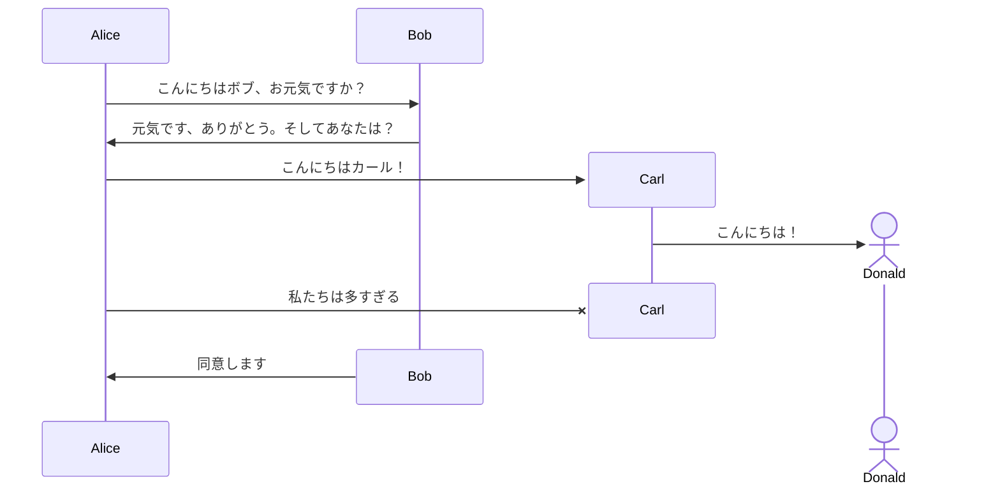
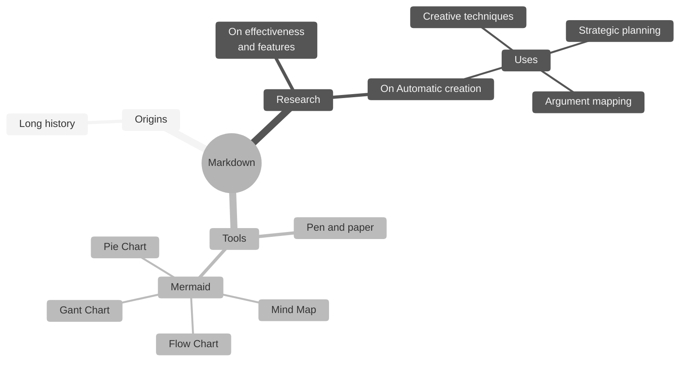

 

### 🧜‍♀️ Mermaidとは
- JavaScriptベースの図表作成ツール
- 製作者:[Knut Sveidqvist](https://github.com/knsv) 
- 製作年度:2014 
  

> Jekyll環境においては、mermaidを使いたいページのヘッダーに **mermaid: true** を記載すること
{: .prompt-warning }

  

###  ◽利用できる図
代表的な図のみ記載詳しくは、公式ページを参照

> #### フローチャート 

[参照:フローチャート構文](https://docs.min87.com/ja/mermaid/syntax/flowchart.html)
{: .prompt-info }

 

> #### ガントチャート 

[参照:ガントチャート構文](https://docs.min87.com/ja/mermaid/syntax/gantt.html)
{: .prompt-info }

 

> #### 円グラフ 

[参照:円グラフ構文](https://docs.min87.com/ja/mermaid/syntax/pie.html)
{: .prompt-info }

 

> #### シーケンス図 

[参照:シーケンス構文](https://docs.min87.com/ja/mermaid/syntax/sequenceDiagram.html)
{: .prompt-info }

 

> #### マインドマップ 

[参照:マインドマップ構文](https://docs.min87.com/ja/mermaid/syntax/mindmap.html)
{: .prompt-info }

 

### 📚 参考
- [Mermaidドキュメント](https://docs.min87.com/ja/mermaid/intro/)