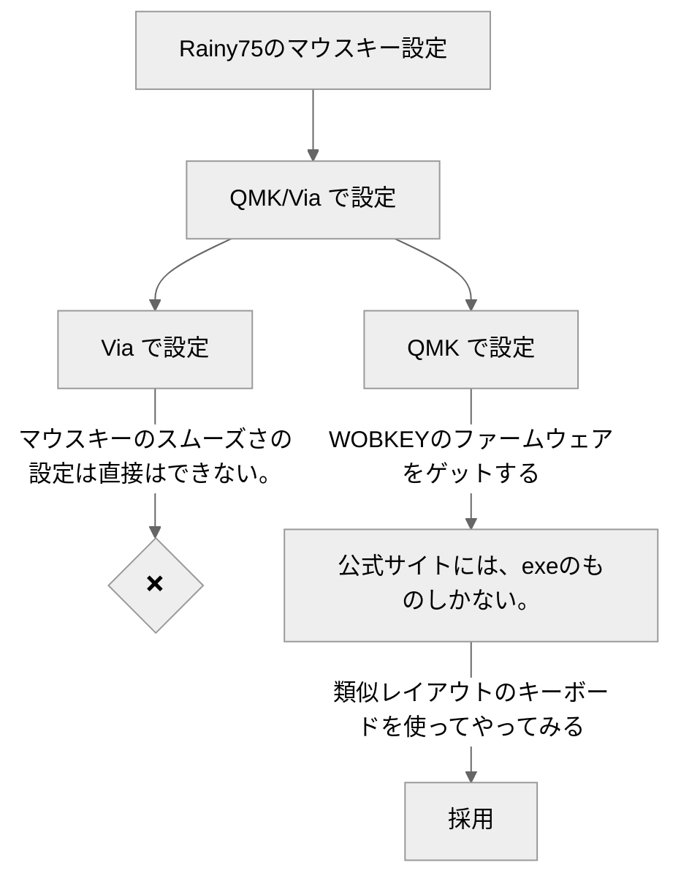
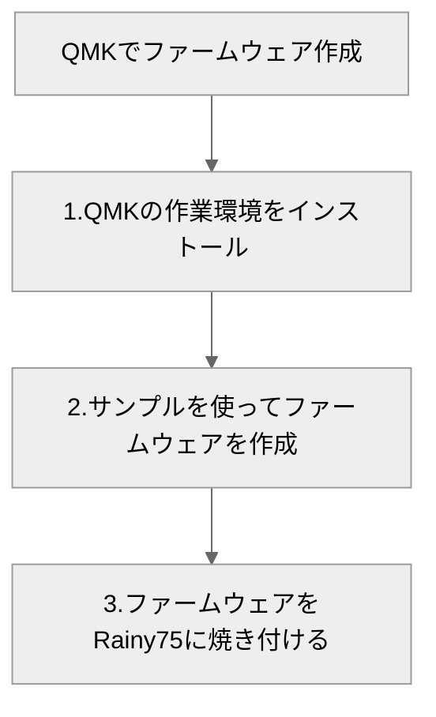
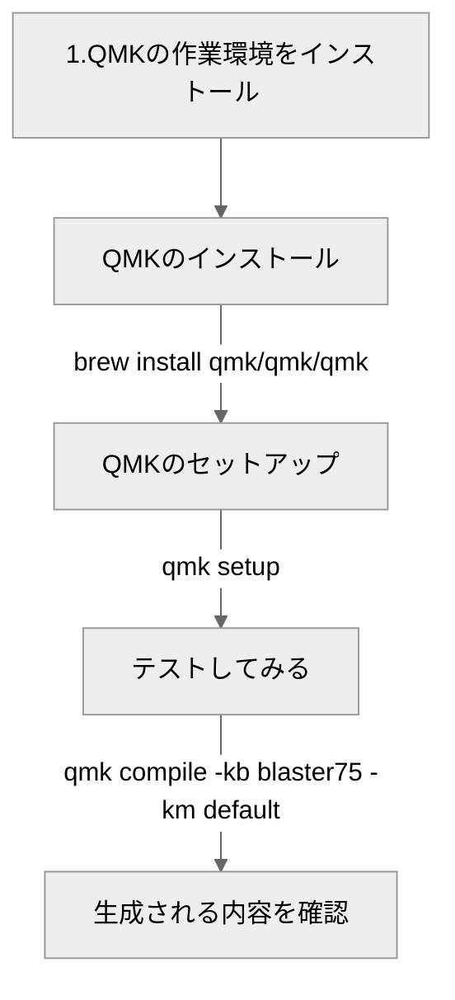
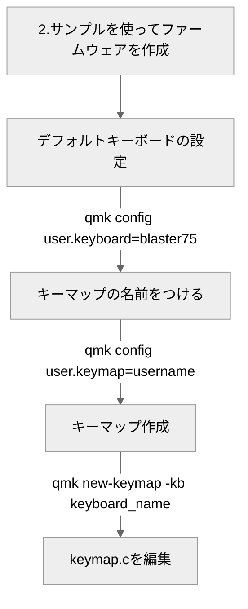

<!-- no robot! -->
<meta name="robots" content="noindex">

<!-- border setting -->

## 結論　 
Tri-modeスイッチのソースコードがないので、ソースコードが手に入るか、 
実装方法がわかるまではやらない。有線接続以外使えなくなる可能性があるので。
Bluetoothとか2.4GhzのUSBドングルの仕様はQMKで実装してる例が見つからない。
もしかしたら、 KeyChronとかは独自に実装してるのかもしれないけど、
実装するとしたら、ZMKとか別のファームウェアを使って実装してる例が多い。
なので、中華系のベンダーは複数のファームウェアを組み合わせてるまたは、
独自実装してるのかも。Via実装してるとウケがいいってことで、Via用のJsonだけ
提供して、内部実装は秘匿しとくと。。ま、一般ユーザー的にはそこまで深く触らなくても満足できる
⌨️になってると思う。

  

#### 方針決め
>**やりたいこと** 
Rainy75でマウスポインターをスムーズに動かして、マウスレスで作業したい。

{: .prompt-info }

 

     
        
#### QMK設定方針

 

     
### QMK作業詳細
#### 1.QMKの作業環境をインストール 

>️用意するファイル 
- **keyboard.json**     
QMK用のキーボードjsonファイル  
- **keymap.c**          
QMK用キーボードマッピングファイル  
- **via.json**    
via用キーボードマッピングファイル  
- **rules.mk**   
VIA_ENABLE = yes と書いただけのファイル  
- **config.h**  
QMK用マウススピードの調整とかする設定ファイル
{: .prompt-warning }

 

 

#### 2.サンプルを使ってファームウェアを作成 

ここで作業断念！ 
必要なファイルを揃えて、あとはマイコンにファームウェア焼き付ければOKくらいの段階だった。
ふと、キーマップの配置中に疑問が出た。BluetoothとかUSBデバイスでの通信とか有線以外に切り替える時の
キーはカスタムされてるっぽい。これって具体的に、QMKのconfig.hなりにどう書かれてるんだ？というか
QMK外での実装もされてるかも、だからあえて、ファームウェアの更新とかは、exeファイルだけよこして
内部実装を秘匿しているのか？ 実装方法が分からない箇所を放置してファームウェアを焼き付けちゃうと、
機能しなくなりそうだ。ということで、一旦作業中止。

 

## ‍️補足　
### ⌨️ Rainy75は厳密にはQMK対応していない。
QMK/Via対応を謳うにはライセンスの規約上、改変したコードはパブリックに公開する必要があるが、
githubレポジトリへの登録がないため、ライセンス違反になっている。(後継のCrush80,Zen65も同様) 
via用のJSONファイルは提供されているし、ファームウェアの更新が必要な場合は、 
exeファイルも公式サイトに置いてあるので、viaをいじって作業する限りは何の問題もない。
 
 

[githubから一部抜粋](https://docs.qmk.fm/license_violations#offending-vendors)
 

|Vendor|Reason|
|---|---|
|WOBKEY|Selling tri-mode boards based on QMK without sources,   attempted upstreaming crippled firmware without wireless.| 

 

### 📚 参考
#### Github
- [QMK](https://github.com/qmk)
- [Via](https://github.com/the-via)

#### Blog
- [VIAのマクロでマウスキーを使う方法](https://pmortensen.eu/world2/2024/02/26/a-hack-to-use-mouse-actions-in-via-macros/)
- [QMKマクロ応用編](https://getreuer.info/posts/keyboards/macros/index.html)
- [自作キーボードのVIA対応方法](https://note.com/sam1dare/n/n816ce95fb2f2)

#### Others
- [QMK Configurator](https://config.qmk.fm/#/atreus/f103/LAYOUT_pcb_up)
- [QMK Keycodes](https://docs.qmk.fm/keycodes)