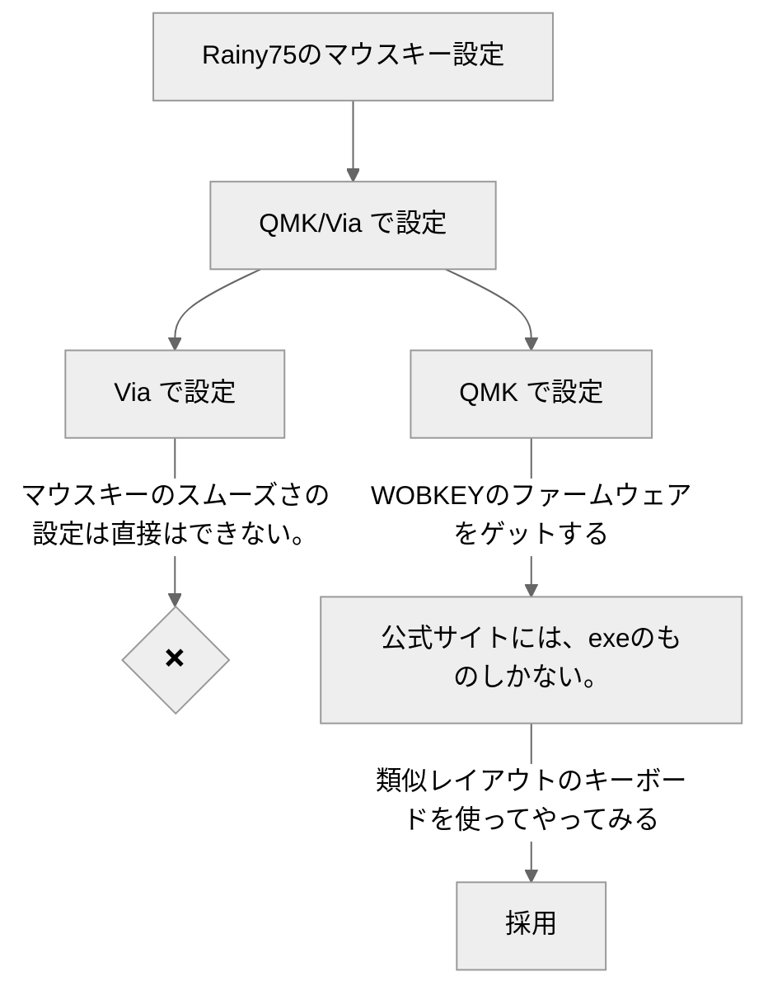
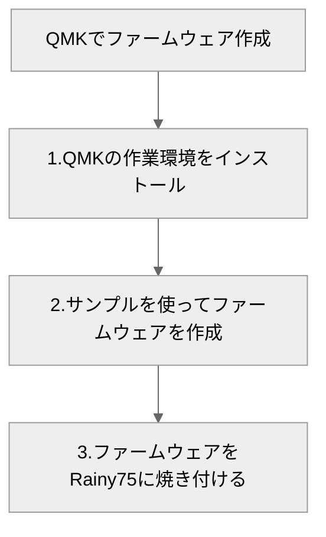
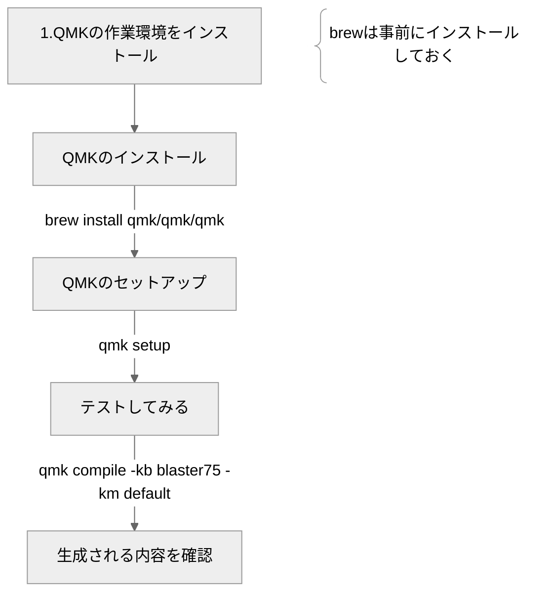

 

### ‍️⌨️ Rainy75は厳密にはQMK対応していない。
QMK/Via対応を謳うにはライセンスの規約上、改変したコードはパブリックに公開する必要があるが、
githubレポジトリへの登録がないため、ライセンス違反になっている。(後継のCrush80,Zen65も同様)
 
 

[githubから一部抜粋](https://docs.qmk.fm/license_violations#offending-vendors)
 

|Vendor|Reason|
|---|---|
|WOBKEY|Selling tri-mode boards based on QMK without sources,   attempted upstreaming crippled firmware without wireless.| 

 

#### 方針
>**やりたいこと** 
Rainy75でマウスポインターをスムーズに動かして、マウスレスで作業したい。

{: .prompt-info }

 

     
        
#### QMK設定方針

 

     
#### QMK作業詳細
##### 1.QMKの作業環境をインストール 

### 📚 参考
#### Github
- [QMK](https://github.com/qmk)
- [Via](https://github.com/the-via)
