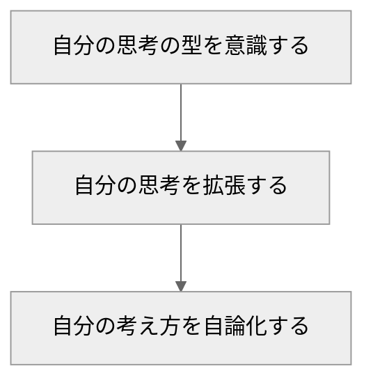
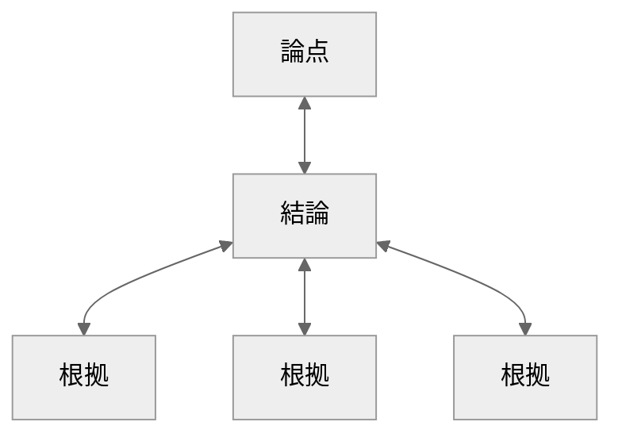
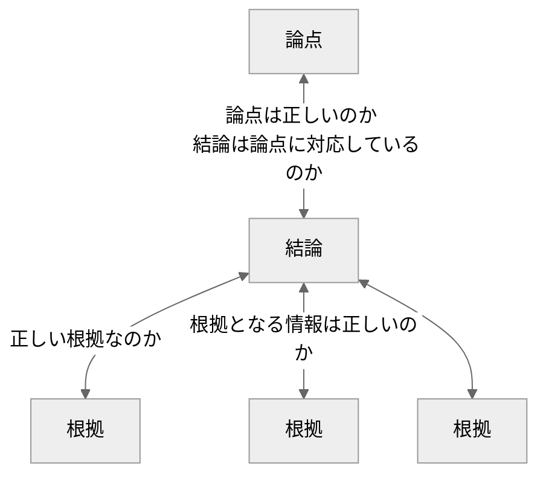
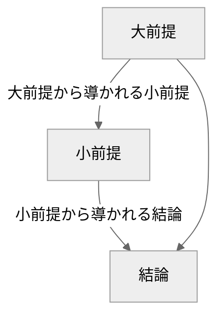
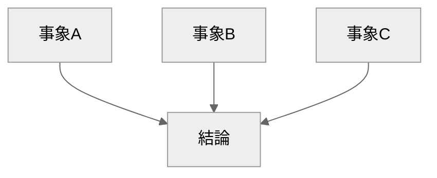
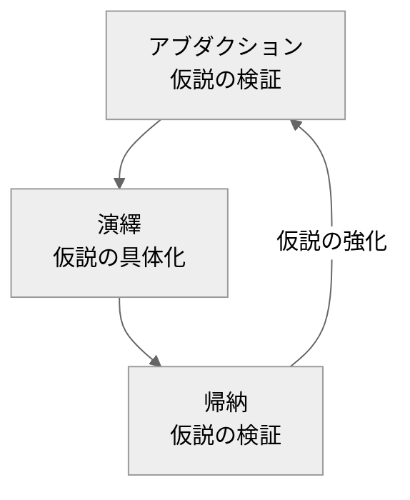

 
<!-- no robot! -->
<meta name="robots" content="noindex">

<!-- border setting -->

### 思考法図鑑の活用レベル

 

## 思考法
### Logical Thinking
結論と根拠のつながりを明確にし、客観的かつ合理的に考えるための思考法。

`考え方`
1. 論点を決める
2. 情報を集める
3. 何が言えるかを考える
4. 論理を構造化する

>

{: .prompt-tip }

 
 

 

### Critical Thinking
前提は正しいのか、結論と前提は本当に繋がっているのかなど、 
客観的かつ批判的な目線でする思考法。

`考え方`
1. 論理を展開する
2. 論点を疑う
3. 結論と根拠のつながりを疑う
4. 前提を疑う

>

{: .prompt-tip }

 
 

 

### Deductive Reasoning(演繹法/えんえきほう)
常識的な情報から小前提を導き出してそこから結論にむすびつける考え方。

`考え方`
1. 大前提を把握する
2. 小前提を把握する
3. 結論を導く

>

{: .prompt-tip }

`補足` **推論とは**  
推論とは、既知の情報から未知の結論を導き出す、思考過程のこと。

 
 

 

### Inductive Reasoning(帰納法/きのうほう)
物事の共通項から一般的な結論を導く思考法。

`考え方`
1. サンプルを集める
2. 一般化して結論を導き出す

>

{: .prompt-tip }

 
 

 

### Abductive Reasoning(仮説推論)
事実から仮説を考察する思考法。

`考え方`
1. 事実を確認する
2. 説明仮説を立てる
3. 説明仮説を検証する

>

{: .prompt-tip }

