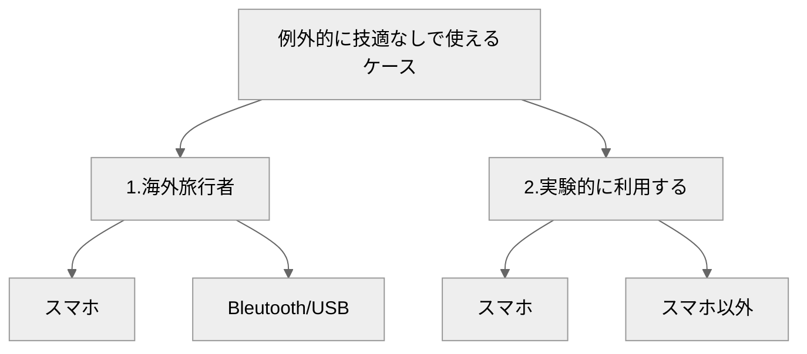

{: align="right"}
[画像出典: 総務省](https://www.tele.soumu.go.jp/RMPR2025/index.html)

<!-- no robot! -->
<meta name="robots" content="noindex">

<!-- border setting -->

## 結論　 
技適マークなしでの無線利用は、違法。有線で利用するなら問題なし。

  

### 技適マークがないとどうなるか
電波法違反なので、無断利用が発覚した場合、１年以下の懲役又は１００万円以下の罰金の対象となる。

 

以下、IIJのブログから抜粋↓

> 電線や光ファイバーでつながれた有線通信と違い、無線機が発した電波はアンテナを中心として辺り一面に広がっていきます。そのため、不用意に電波を発射すると他の無線機や電子機器に想定外の影響を与えてしまうことがあります。そういったことのないように、電波や無線機の利用は世界中で各国の政府によって管理・調整されています。日本では電波の管理は総務省が担当しており、原則として免許を受けなければ電波は利用できません。**免許を受けずに電波を発信すると「不法無線局」として処罰を受けることがあります。**ですが、スマートフォン・Wi-Fiルータ・bluetoothヘッドセットのように多くの人が大量に利用する機器の場合、個別に免許を発行するのは非常に手間がかかり現実的ではありません。そこで、**一部特定の利用用途については、個別の免許なしに機器(無線機)を利用しても良い、という特例措置が設けられています。**スマートフォンを含めた携帯電話機・Wi-Fi機器・bluetooth機器や、一部のトランシーバー、コードレスホン、無線接続のセンサー・制御機器などが特例の対象となっています。
 

&copy;(堂前 清隆, 2019, [iij てくろぐ](https://techlog.iij.ad.jp/archives/2689))

 

総務省に問い合わせした人がもらった回答↓
> 現時点で技適を取得していないものは使えません。Bluetoothなどで一定の基準は満たしているはずですが、実際に測定して基準を超えるパターンもあり得るためです。継続的に注意喚起をしていますが同様の商品は結構出回っており、販売時に規制や罰則がない状況が良くないんです。
 

&copy;(参考サイトの管理人, 2023, [note](https://note.com/plz_reference/n/ne7cebb574788))

 

刑事罰↓
> 一部の無線機を除いて、技適マークが付いていない無線機を使用すると、電波法違反になる恐れがあります。免許を受けずに無線局を開設若しくは運用した場合は電波法違反となり、１年以下の懲役又は１００万円以下の罰金の対象となります。また、公共性の高い無線局に妨害を与えた場合は、５年以下の懲役又は２５０万円以下の罰金の対象となります

 

### 例外的に使えるケース

 

#### 1.海外旅行者
1. スマホ 海外で利用されていた携帯電話(スマートフォン)が、日本の技術基準適合証明に相当する海外の技術基準に適合している場合、包括免許の範囲内で運用して良い(個別の免許を取得しなくて良い)。

2. Bluetooth/USB 海外からの旅行者が持ち込んだ機器が、日本の技術基準適合証明に相当する海外の技術基準に適合している場合、入国から90日間に限り技適マークが表示された機器と同様に扱って良い。

 

#### 2.実験的に利用するケース
1. スマホ まず携帯電話事業者が許可を取得する。利用者(実験者)は携帯電話会社と契約する。届け出は携帯電話事業者がまとめて行う。

2. スマホ以外 Wi-Fiやbluetoothなど、告示された規格に沿っていれば利用者(実験者)自身が直接届出できる。

  

### 📚 参考
- [IIJブログ: 技適マークのない製品の利用について](https://techlog.iij.ad.jp/archives/2689)
- [総務省: 電波ポータル](https://www.tele.soumu.go.jp/j/adm/monitoring/index.htm)
- [技適の話](https://note.com/plz_reference/n/ne7cebb574788)
- [ムセンコネクト: サルでもわかるBLE入門(2)](https://www.musen-connect.co.jp/blog/course/trial-production/ble-beginner-2/)